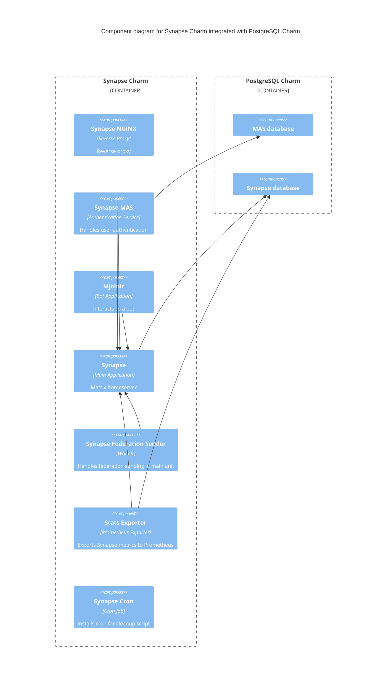

# Charm architecture

Synapse is a drop in replacement for other chat servers like Mattermost and
Slack. It integrates with [PostgreSQL](https://www.postgresql.org/) as its database,
which is provided by the [PostgreSQL charm](https://charmhub.io/postgresql).

Pebble is a lightweight, API-driven process supervisor that is responsible for
configuring processes to run in a container and controlling those processes
throughout the workload lifecycle.



### Pebble layers

The Synapse charm deploys a container named `synapse` with the following Pebble layers configured:

1. `synapse`: This layer is present on all units. It contains the Synapse application service and is started with different commands depending on whether the unit is the leader or not.

2. `synapse-cron`: Installs a cron script that helps clean up empty directories within Synapse's media content storage locations. These directories can accumulate and consume index nodes and disk space, and the cron job ensures they are purged.

3. `synapse-nginx`: Configures NGINX to efficiently serve static resources and acts as the entry point for all web traffic to the pod.

4. `synapse-federation-sender`: Runs a Synapse worker instance responsible for sending federation requests. By offloading this task from the main unit, the layer helps improve the performance of the main unit. Only the main unit runs this layer.

5. `stats-exporter`: A Prometheus exporter that collects statistical metrics from the Synapse database. Like the synapse-federation-sender, this layer runs only on the main unit.

6. `synapse-mas`: Configures the Matrix Authentication Service (MAS) on the unit.

7. `mjolnir`: Matrix moderation bot tool. This layer runs only on the main unit.

### Scaling behavior

When Synapse is scaled, not all layers are added to every unit. Only one unit is elected as the main (leader) unit, while the others are worker units.

To demonstrate the difference, here’s what you can expect when logging in using `kubectl` to the main and worker units:

#### Leader unit (main)

```bash
kubectl exec -it synapse-1 -c synapse -- /bin/bash
```

In the leader unit, you'll observe the following processes:

```bash
root@synapse-1:/# ps -ef
UID          PID    PPID  C STIME TTY          TIME CMD
root           1       0  0 Feb19 ?        00:29:52 /charm/bin/pebble run --create-dirs --hold --http :38813 --verbose
root          46       1  0 Feb19 ?        00:05:42 /usr/bin/python3 /usr/local/bin/synapse-stats-exporter
root         119       1  0 Feb19 ?        00:00:07 /usr/sbin/cron -f -P
root        1837       1  0 Feb24 ?        00:12:37 node /mjolnir/index.js --mjolnir-config /data/config/production.yaml
synapse     3994       1  1 Mar10 ?        02:01:19 /usr/bin/python3 -m synapse.app.homeserver --config-path /data/homeserver.yaml
synapse     4004       1  0 Mar10 ?        01:02:13 /usr/bin/python3 -m synapse.app.generic_worker --config-path /data/homeserver.yaml --config-path /data/worker.yaml
synapse     4004       1  0 Mar10 ?        01:02:13 mas-cli server -c /mas/config.yaml
root        4014       1  0 Mar10 ?        00:00:00 nginx: master process /usr/sbin/nginx
nginx       4015    4014  0 Mar10 ?        00:02:03 nginx: worker process
```

#### Worker unit

```bash
kubectl exec -it synapse-0 -c synapse -- /bin/bash
```

In the worker unit, you'll observe the following processes:

```bash
root@synapse-0:/# ps -ef
UID          PID    PPID  C STIME TTY          TIME CMD
root           1       0  0 Feb19 ?        00:20:55 /charm/bin/pebble run --create-dirs --hold --http :38813 --verbose
synapse      825       1  0 Mar10 ?        01:11:12 /usr/bin/python3 -m synapse.app.generic_worker --config-path /data/homeserver.yaml --config-path /data/worker.yaml
synapse     4004       1  0 Mar10 ?        01:02:13 mas-cli server -c /mas/config.yaml
root         835       1  0 Mar10 ?        00:00:00 nginx: master process /usr/sbin/nginx
nginx        836     835  0 Mar10 ?        00:01:32 nginx: worker process
```

### Expected services status

On the leader unit, the following Pebble services will be active:

```bash
root@synapse-1:/# /charm/bin/pebble services
Service                    Startup   Current  Since
mjolnir                    enabled   active   21 days ago, at 08:57 UTC
stats-exporter             disabled  active   26 days ago, at 17:29 UTC
synapse                    enabled   active   7 days ago, at 17:35 UTC
synapse-cron               enabled   active   26 days ago, at 17:30 UTC
synapse-federation-sender  enabled   active   7 days ago, at 17:35 UTC
synapse-nginx              enabled   active   7 days ago, at 17:36 UTC
synapse-mas                enabled   active   7 days ago, at 17:36 UTC
```

On the worker unit, the status will be:

```bash
root@synapse-0:/# /charm/bin/pebble services
Service        Startup  Current   Since
synapse        enabled  active    7 days ago, at 17:35 UTC
synapse-cron   enabled  inactive  -
synapse-nginx  enabled  active    7 days ago, at 17:35 UTC
synapse-mas    enabled  active    7 days ago, at 17:35 UTC
```

### Summary

- Main unit (leader): Runs all configured layers.
- Worker units: Run only a subset of layers (Synapse, NGINX, and MAS).

## OCI images

We use [Rockcraft](https://canonical-rockcraft.readthedocs-hosted.com/en/latest/)
to build OCI Image for Synapse.
The image is defined in [Synapse rock](https://github.com/canonical/synapse-operator/tree/main/synapse_rock) and is published to [Charmhub](https://charmhub.io/), the official repository
of charms.
This is done by publishing a resource to Charmhub as described in the
[Juju SDK How-to guides](https://juju.is/docs/sdk/publishing).

## Container

Configuration files for the container can be found in the respective
directory that define the rock, see the section above.

<!-- vale Canonical.007-Headings-sentence-case = NO -->
### NGINX
<!-- vale Canonical.007-Headings-sentence-case = YES -->

NGINX is configured as a Pebble Layer and is the entry point for all web traffic
to the pod (on port `8080`). Serves static files directly and forwards
non-static requests to the Synapse container (on port `8008`).

NGINX provides static content cache, reverse proxy, and load balancer among 
multiple application servers, as well as other features. It can be used in front of
Synapse server to significantly reduce server and network load.

### Synapse

Synapse is a Python application run by the `start.py` script.

Synapse listens to non-TLS port `8008` serving by default. NGINX can then
forward non-static traffic to it.

The workload that this container is running is defined in the [Synapse rock](https://github.com/canonical/synapse-operator/tree/main/synapse_rock).

If Synapse is integrated with PostgreSQL, [Synapse Stats Exporter](https://github.com/canonical/synapse_stats_exporter) will be enabled.
Synapse Stats Exporter listens to non-TLS port `9877` and will be configured as a
target if the charm is integrated with Prometheus. It will provide two metrics: number of rooms and
number of users.

## Integrations

See [Integrations](https://charmhub.io/synapse/docs/reference-integrations).

## Charm code overview

The `src/charm.py` is the default entry point for a charm and has the
`SynapseOperatorCharm` Python class which inherits from the `CharmBase`.

CharmBase is the base class from which all Charms are formed, defined by [Ops](https://documentation.ubuntu.com/ops/latest/)
(Python framework for developing charms).

See more information in [Charm](https://documentation.ubuntu.com/juju/3.6/reference/charm/).

The `__init__` method guarantees that the charm observes all events relevant to
its operation and handles them.

Take, for example, when a configuration is changed by using the CLI.

1. User runs the command
```bash
juju config synapse server_name=myserver.myserver.com
```
2. A `config-changed` event is emitted
3. Event handlers are defined in the charm's framework observers. An example looks like the following:
```python
self.framework.observe(self.on.config_changed, self._on_config_changed)
4. The method `_on_config_changed` will take the necessary actions. 
The actions include waiting for all the relations to be ready and then configuring
the containers.